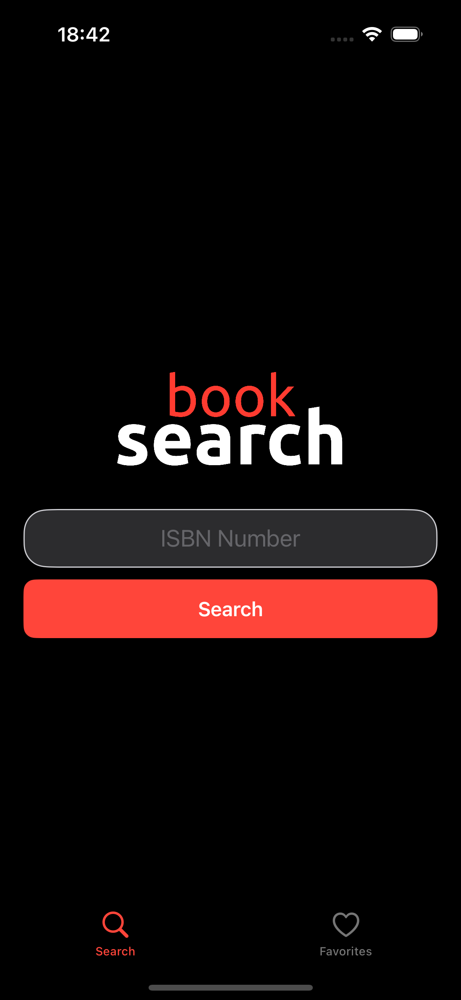
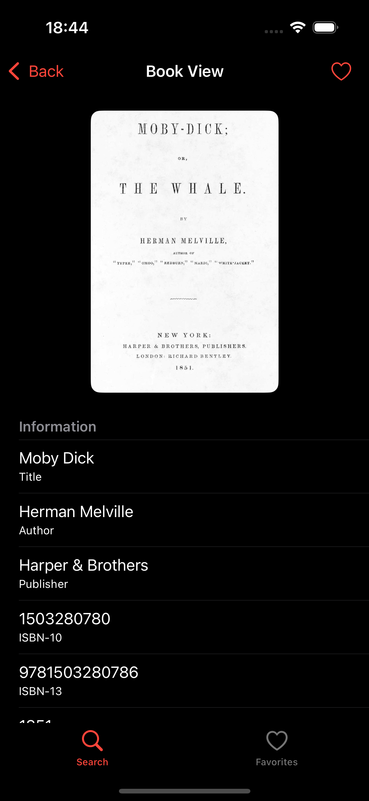
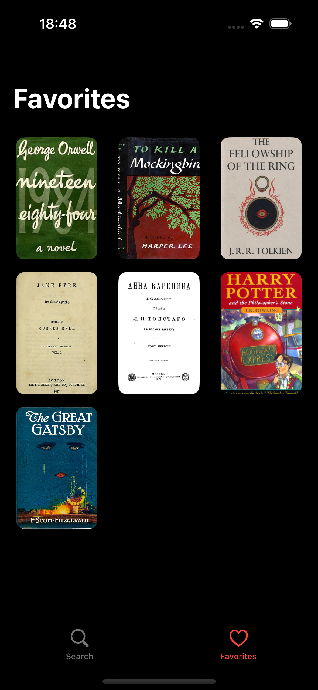
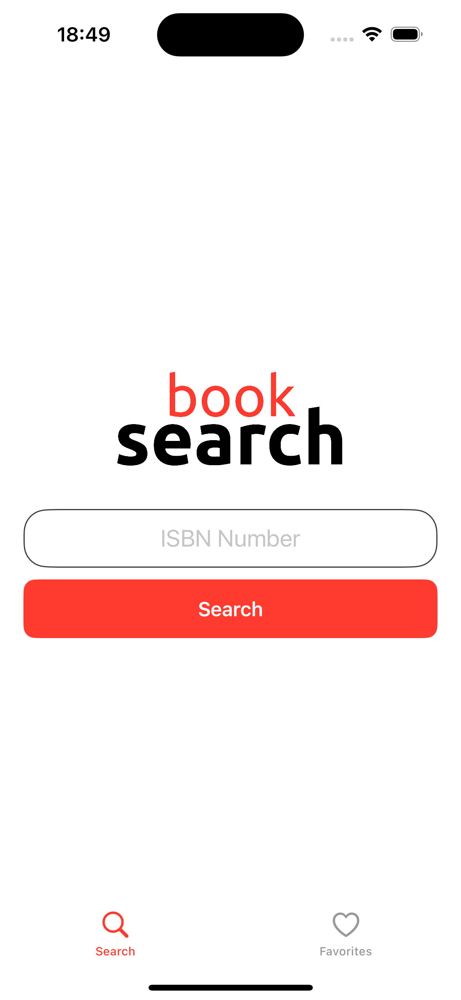
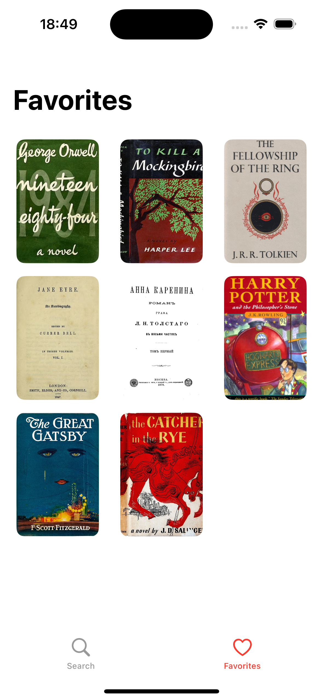
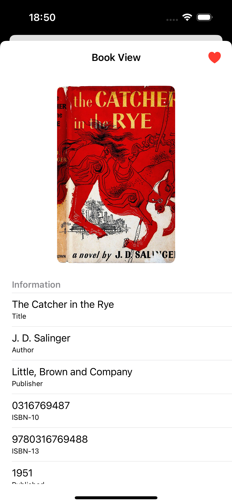

## Book Search App

This iOS app allows users to search for books by ISBN, view detailed information and save favorites. Built with `programmatic UIKit` in the `MVC` architecture, it features custom `reusable UI components` and supports both CollectionView and TableView. The app is fully compatible with `Dark Mode`, uses `Alamofire` for network communication and implements a `Persistence Manager` for local data storage.

### 0. Video Preview

https://github.com/user-attachments/assets/83d7e6a6-2120-487f-97a7-7baba8a3db82

### 1. Screens

1. **Dark Mode**

<div style="float: left;">
    
    
    
</div>

2. **Light Mode**

<div style="float: left;">
    
    
    
</div>

### 2. Warning

Please note that this application includes `two types of APIs` for backend usage:

- [otegecmis/book-search-api](https://github.com/otegecmis/book-search-api)
- [otegecmis/book-search-mock-api](https://github.com/otegecmis/book-search-mock-api)

### 3. Installation

1. **Clone the repository**

```sh
git clone https://github.com/otegecmis/book-search-app.git
```

2. **Navigate to the project directory**

```sh
cd book-search-app
```

3. **Open the Xcode project**

```sh
open book-search-app.xcodeproj
```

4. **Set up the API URL**

Go to the `Constants.swift` file and fill in the `API_URL` variable.

5. **Run the app**

Press the `Run` button in Xcode or use the shortcut `Cmd + R`.
